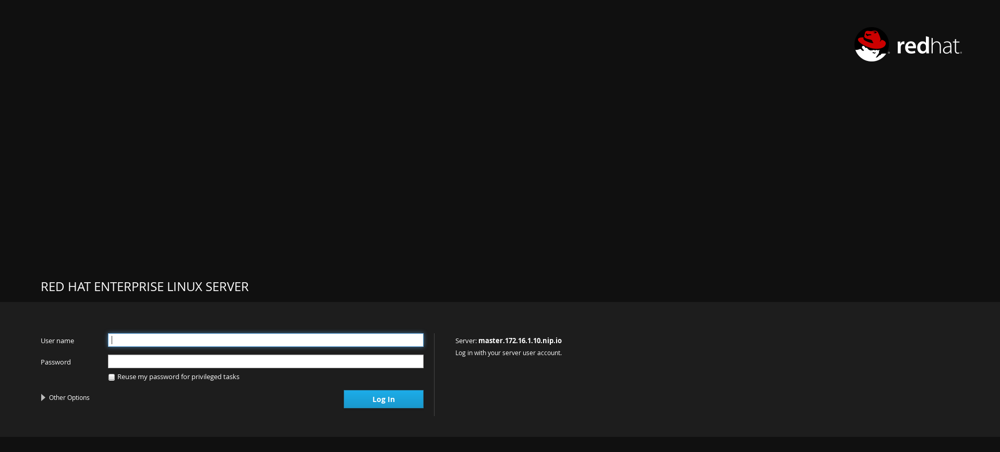

# Installing and Using Cockpit

In this lab you will learn how to install Cockpit; which can be seen as the "Administration Page" for OpenShift. It contains tools to manage your cluster plus a plugin ffor Kubernetes.

**NOTE:** This lab REQUIRES that you have the `root` login enabled with a password. If you are on a cloud installation or if you would rather not use the `root` account; please see [how to deploy Cockpit as a container](deploying_cockpit_as_a_container.md).

## Step 1

You will need to install the proper packages on all servers taking part of the cluster (including the master). You can do this leverging ansible.

```
ansible all -m shell -a "yum -y install cockpit-*"
```

Enable the `cockpit.socket` to start up the webui. Do this on the master only.

```
systemctl enable cockpit.socket
```

## Step 2

Navigate to your master on port 9090 on your web browser. It should look something like this.



## Step 3

## Step 4

## Conclusion

In this lab you learned how to ...
